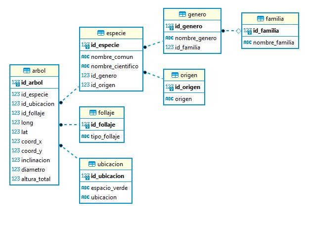

# Foundations

# Dataset utilizado

Se tomo el dataset __Arbolado en Espacios Verdes__ provisto por el Gobierno de la Ciudad de Buenos Aires con información geolocalizada de los árboles en espacios verdes (jardín, parque, patio recreativo, plaza, plazoleta, cantero y polideportivo) de la Ciudad según su especie.

## Link de dataset

https://cdn.buenosaires.gob.ar/datosabiertos/datasets/arbolado-en-espacios-verdes/arbolado-en-espacios-verdes.csv

## Formato

|Título de la columna|Tipo de dato|Descripción|
|:--------------:|:----------------:| ----- |
|long            | Número flotante  |Coordenadas para geolocalización |
|lat             | Número flotante  |Coordenadas para geolocalización |
|id_arbol        | Número entero    |Identificador único del árbol |
|altura_tot      | Número entero    |Altura del árbol (m)|
|diametro        | Número entero    |Diámetro del árbol (cm) |
|inclinacio      | Número entero    |Inclinación del árbol (grados) |
|id_especie      | Número entero    |Identificador de la especie |
|nombre_com      | Texto            |Nombre común del árbol |
|nombre_cie      | Texto            |Nombre científico del árbol |
|tipo_folla      | Texto            |Tipo de follaje del árbol |
|espacio_ve      | Texto            |Nombre del espacio verde |
|ubicacion       | Texto            |Dirección del espacio verde |
|nombre_fam      | Texto            |Nombre de la familia del árbol |
|nombre_gen      | Texto            |Nombre del género del árbol |
|origen          | Texto            |Origen del árbol |
|coord_x         | Número flotante  |Coordenadas para localización |
|coord_y         | Número flotante  |Coordenadas para localización |


# Base de datos

## Diagrama ER



## DDL de la base
### arbol
```
CREATE TABLE arbol (
	id_arbol int4 NOT NULL,
	id_especie int4 NOT NULL,
	id_ubicacion int4 NOT NULL,
	id_follaje int4 NOT NULL,
	long numeric NULL,
	lat numeric NULL,
	coord_x numeric NULL,
	coord_y numeric NULL,
	inclinacion int4 NULL,
	diametro int4 NULL,
	altura_total int4 NULL,
	CONSTRAINT pk_arbol PRIMARY KEY (id_arbol),
	CONSTRAINT fk_arbol_especie FOREIGN KEY (id_especie) REFERENCES especie(id_especie) ON UPDATE CASCADE,
	CONSTRAINT fk_arbol_follaje FOREIGN KEY (id_follaje) REFERENCES follaje(id_follaje) ON UPDATE CASCADE,
	CONSTRAINT fk_arbol_ubicacion FOREIGN KEY (id_ubicacion) REFERENCES ubicacion(id_ubicacion) ON UPDATE CASCADE
);
```
### especie
```
CREATE TABLE especie (
	id_especie int4 NOT NULL,
	nombre_comun bpchar(100) NULL,
	nombre_cientifico bpchar(100) NULL,
	id_genero int4 NOT NULL,
	id_origen int4 NOT NULL,
	CONSTRAINT pk_especie PRIMARY KEY (id_especie),
	CONSTRAINT fk_especie_genero FOREIGN KEY (id_genero) REFERENCES genero(id_genero) ON UPDATE CASCADE,
	CONSTRAINT fk_especie_origen FOREIGN KEY (id_origen) REFERENCES origen(id_origen) ON UPDATE CASCADE
);
```
### familia
```
CREATE TABLE familia (
	id_familia int4 NOT NULL,
	nombre_familia bpchar(30) NULL,
	CONSTRAINT pk_familia PRIMARY KEY (id_familia)
);
```
### follaje
```
CREATE TABLE follaje (
	id_follaje int4 NOT NULL,
	tipo_follaje bpchar(50) NULL,
	CONSTRAINT pk_follaje PRIMARY KEY (id_follaje)
);
```
### origen
```
CREATE TABLE origen (
	id_origen int4 NOT NULL,
	origen bpchar(100) NULL,
	CONSTRAINT pk_origen PRIMARY KEY (id_origen)
);
```

### ubicacion
```
CREATE TABLE ubicacion (
	id_ubicacion int4 NOT NULL,
	espacio_verde bpchar(500) NULL,
	ubicacion bpchar(500) NULL,
	CONSTRAINT pk_ubicacion PRIMARY KEY (id_ubicacion)
);
```

# Proceso end2end

## Imagenes y contenedores Docker

- **Container**: pg_container - **Imagen**: postgres:12.7 
	- Crea de base de datos ejecutando el script /bash/creacion.sh
- **Container**: cargar - **Imagen**: python:3.7.5-slim
	- Popula la base mediante el script python-carga\script\carga.py 
- **Container**: consultar - **Imagen**: python:3.7.5-slim
	- Realiza las consultas mediante el script python-consulta\script\consulta.py

## Ejecucion de containers 

Con la ejecucion de del script de bash `end2end.sh` se dispara `docker-compose.yml` encargado de creacion y ejecucion de las imagenes y containers del proceso.

En caso de querer hacer consultas por separado o nuevas, se puede editar el archivo `python-consulta\script\consulta.py` y ejecutar los siguientes comandos:
```
docker build -t consulta .
docker run --net tpf-foundations-sebastardo_sebanet consulta
```

# Consultas 

Se realizaron 5 consultas para la prueba de la base datos combinando consultas sql y manejo en pandas. Se utilizo la biblioteca *sqlalchemy*

## Titulo y Especies de arboles mas frecuentes

Mediante una consulta sql a la base se extrae la cantidad de arboles segun el nombre.
Para el titulo se suman todas esas cantidades, para el informe se ordenan esas cantidades y tambien se calcula cual es el porcentaje del total.

## Espacios verdes con mayor cantidad de especies exoticas y la mas predominante

Se hace una consulta sql a las tablas *arbol*, *especie*, *origen* y *ubicacion* que tengan un campo origen como 'Exótico' agrupandolo por espacio_verde primero y por nombre_comun despues.
La consulta se guarda en un dataframe al cual se le suma el total de arboles de cada espacio verde en un nuevo dataframe y de cada espacio verde, el arbol que mas cantidad tiene en otro dataframe.
Una vez conseguidos esos datos, se hace merge de ambos dataframe, se renombran columnas para mejor lectura y se muestran.

## Ubicación de arboles de especie nativa de mayor altura

Se consultan datos de tablas arbol, especie y origen buscando que el origen sea Nativo/Autóctono y tambien se consulta la tabla completa de ubicacion.
Se hace merge de los dataframes haciendo join por id_ubicacion y se ordena segun la altura total.

## Follaje predominante de todo el arbolado

En este caso se hacen dos consultas, una a arbol con solo los ids de arbol y follaje, y otra completa a follaje.
Los dataframes se agrupan por tipo de follaje y se hace un conteo de los arboles de cada grupo. Ese df se ordena por la cantidad calculada y se ordena mostrando los 3 tipos mas predominantes.

## Espacios verdes mas poblados

Se realiza una query completa de ubicacion y una query de los campos id_arbol y id_ubicacion de arbol.
Se unen los dataframes creados y se agrupa el nuevo df mediante espacio verde y ubicacion para asi contar los arboles, se lo ordena de mayor a menor y se muestran los 5 primeros.
